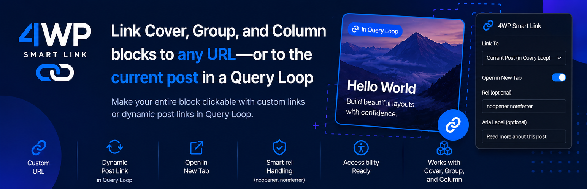

# 4WP Smart Link

[](https://wordpress.org/plugins/4wp-smart-link/)
[](https://wordpress.org/plugins/4wp-smart-link/)
[](https://www.gnu.org/licenses/gpl-2.0.html)



**Make Cover, Group, and Column blocks fully clickable** in Gutenberg and Query Loop—custom URL or dynamic link to the current post. No wrapper block, no custom code.

A plugin by **[4wp.dev](https://4wp.dev/plugin/4wp-smart-link/)**.

## Demo

https://www.youtube.com/watch?v=8ZGojkTl2CM

## Install

- **[WordPress.org](https://wordpress.org/plugins/4wp-smart-link/)** — recommended for production sites.
- **Development:** clone this repo, run `npm install && npm run build`, then activate the plugin.

## What it does

- Adds **Smart Link** controls to **Cover**, **Group**, and **Column** (toolbar + inspector).
- **Custom URL** or **Post Link** (Query Loop `postId` context) per block.
- **Anchor mode** when the block has no inner links — crawlable `<a>` around the whole block.
- **Host mode** when inner links exist (title, terms, buttons) — no link-in-link HTML; padding/image clicks open the Smart Link URL; inner links stay separate.

## Quick start

1. Edit a **Cover**, **Group**, or **Column** in the block editor.
2. Open **Smart Link** in the block toolbar.
3. Choose **Custom Link** or **Post Link** (inside a Query Loop post template only).
4. Preview or view the published page — the clickable behavior is applied on the **front end**.

## Links

| | |
|---|---|
| Product page | [4wp.dev/plugin/4wp-smart-link](https://4wp.dev/plugin/4wp-smart-link/) |
| WordPress.org | [wordpress.org/plugins/4wp-smart-link](https://wordpress.org/plugins/4wp-smart-link/) |
| Support | [Plugin support forum](https://wordpress.org/support/plugin/4wp-smart-link/) |

## Development

```bash
npm install
npm run build
```

Editor assets output to `build/editor/`. WordPress.org listing assets (icons, banners) live in `.wordpress-org/assets/`; regenerate with:

```bash
.venv-assets/bin/python3 scripts/export-wporg-assets.py
```

## License

GPL v2 or later. See [LICENSE](LICENSE).
